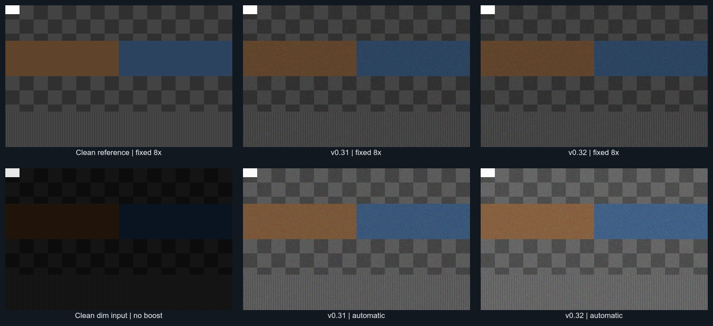

# Night-mode engineering validation — v0.32

Measured October 1, 2026. The change raises supported shadow exposure while measuring temporal uncertainty and suppressing residual color noise. It retains the existing linear-light time average, explicit sample count, highlight roll-off, and exposure controller. The tests below separate brighter rendering from actual noise reduction.

## Processing and scientific basis

Frames are interpreted using the application's existing sRGB contract, decoded with a lookup table, and accumulated in bounded 32-bit channel sums. The sRGB transfer curve follows the [ICC encoding definition](https://registry.color.org/rgb-registry/srgb). This is a delivered-RGB processing assumption; it does not establish that an arbitrary webcam's internal response is radiometrically calibrated.

Up to 1,024 fixed, jittered spatial probes track each pixel's temporal luminance mean, variance, consecutive differences, and encoded chroma variance. Online mean/variance updates avoid retaining a burst. The most variable quarter of shadow probes is excluded to reduce the influence of a small moving subject. The resulting statistics describe delivered pixel variability, rather than confusing stationary scene texture with random noise.

The uncertainty proxy discounts positively correlated samples. It uses `rho = clamp(1 - sum(successive_difference²)/(2*sum(centered_difference²)), 0, 0.8)` and `effective_samples = max(1, samples*(1-rho)/(1+rho))`. This bounded AR(1)-style approximation is a conservative engineering heuristic, not a fitted camera noise model or a statistical confidence interval. Independence matters when estimating uncertainty in an average; see [NIST's autocorrelation guidance](https://www.itl.nist.gov/div898/handbook/eda/section3/autocopl.htm) and [Zhang's study of autocorrelated measurement means](https://www.nist.gov/publications/calculation-uncertainty-mean-autocorrelated-measurements).

The maximum shadow gain is now `min(64, 8*sqrt(samples))`. The floor combines the existing absolute low-code safeguard with twice the estimated linear uncertainty. Thus a single contribution still has the original 8× ceiling, repeated exact black stays black, and high temporal uncertainty can prevent the larger gain. The absolute floor decreases only through 64 contributions. Exposure deadband, bounded transitions, scene-cut recovery, and the 30-second collection ceiling remain in place.

A small 3×3 joint bilateral filter reduces chroma only when predicted residual color noise exceeds its threshold. Spatial proximity, encoded luminance difference, and chroma difference all influence neighbor weights. The chroma term protects boundaries between colors having equal guide luminance. The principle is related to [Tomasi and Manduchi's bilateral filtering paper](https://projects.iq.harvard.edu/sites/projects.iq.harvard.edu/files/imagenesmedicas/files/tomasi1998kg.pdf); this implementation uses its own bounded kernel, range weights, and encoded color representation. It is not the paper's CIE-Lab implementation.

Filtering uses three rows of precomputed guides and runs once on the completed blend. Black and white endpoints remain exact, unsaturated center pixels cannot become newly clipped, alpha remains 255, and infinitesimal filtering cannot introduce a systematic green rounding offset. No image-sized secondary buffer, neural inference, or sharpening stage is added.

## Controlled quality experiment

`tests/night_quality_fixture.h` generates a 256×160 scene containing low-code checkerboard texture, a color boundary, a small bright patch, and one-pixel luminance lines. Noise is the sum of two deterministic uniform integer terms on [0,12], minus 12: zero mean before clipping, standard deviation approximately 5.29 encoded codes. Samples are clipped to [0,255]. Four conditions exercise independent channel noise, noise held unchanged for eight successive source IDs, 4×4 spatially shared channel noise, and common luminance noise.

The v0.31 source was frozen before editing. Both revisions were compiled with the same Release compiler settings and the same final benchmark/fixture sources. The primary quality comparison fixes both revisions to an explicit 8× linear exposure using the existing `NIGHT_IMAGE_LAB` seam. Both report brightness 67 for these cases. RGB mean squared error is measured against the clean scene rendered at that same exposure. Chroma error averages the squared B−G and R−G error differences. These are encoded-image errors, not photon SNR or perceptual quality scores.

| Noise / contributions | RGB MSE v0.31 | RGB MSE v0.32 | Chroma MSE v0.31 | Chroma MSE v0.32 |
|---|---:|---:|---:|---:|
| Independent color / 4 | 42.4309 | 25.4972 | 82.3575 | 31.3738 |
| Independent color / 16 | 11.8769 | 8.7246 | 20.3071 | 10.9616 |
| Independent color / 64 | 4.4906 | 4.4906 | 5.2335 | 5.2335 |
| Held-eight color / 16 | 85.4944 | 54.8890 | 169.3257 | 79.5637 |
| Held-eight color / 64 | 22.0352 | 14.3169 | 41.0721 | 17.9599 |
| Spatial 4×4 color / 16 | 11.7389 | 11.1386 | 19.6374 | 18.1233 |
| Luminance only / 16 | 11.8723 | 11.8723 | 0.0645 | 0.0645 |

For 16 independent contributions this is 26.5% lower RGB error and 46.0% lower chroma error at identical exposure. One-pixel line contrast is 18.7589 codes versus the old 18.7557 and clean reference 19.0000. Already quiet 64-sample fixed-exposure cases and luminance-only cases are unchanged in this fixture. Spatially shared 4×4 noise benefits less because a small local filter sees fewer independent neighbors.

Production automatic exposure is measured separately. On the independent-color 16-sample scene, output brightness rises from 87 to 97, and shadow gain from 16 to 21.0593. Automatic-output MSE must not be compared directly across revisions because their exposures differ. A regression instead renders the exact unfiltered temporal mean at the new output's own gain: RGB MSE is 12.6229 after filtering versus 19.5343 before, and one-pixel contrast is 22.9196 versus 22.9169.



The upper row compares equal 8× exposure; the lower row shows the dim clean input and each revision's automatic output. All panels are synthetic, displayed at 2× nearest-neighbor scale. The clean reference also reveals the small bias introduced by clipped encoded noise and nonlinear linear-light averaging; denoising does not eliminate that bias.

## Confidence, detail, and stability regressions

At input level 8 with 64 nominal contributions, independent noise produces gain 52.7200 and brightness 96. Holding each noisy observation for eight source IDs produces gain 10.8582 and brightness 45. The source count remains 64 in both cases. This demonstrates that temporally repeated noise is not assigned the same confidence as independent observations.

The expanded `night_tests` also verifies:

- Exact black across 1–300 contributions; retained conservative single-frame and low-code limits; coherent level-8 recovery to at least brightness 85 with 64 samples.
- Same-gain error reduction for independent, temporally held, and spatially shared color noise; no material change to luminance-only noise.
- Equal-guide-luminance color-boundary contrast of 126.356 versus 126.656 before filtering, retaining 99.76% of the measured contrast.
- Exact black/white and unsaturated highlight endpoints while the chroma filter is active.
- At most two brightness codes of variation across 12 independent noisy windows of a stationary scene.
- Existing exposure deadband, dawn/cut response, alternating sample counts, 1,000 stable windows, source uniqueness, actual sample counts, and idempotent finish.
- Monotonicity of 76,755 temporal gray means, common-channel color ratios when filtering is unnecessary, and the honest linear-light time average of moving objects.
- No allocations during warmed accumulation, noise estimation, active filtering, or finishing; exact image-buffer budgets and retirement after a resolution change.

All of these synthetic image contracts passed on the recorded final source. This report does not substitute for the application's broader camera, recording, packaging, and UI test suites.

## Runtime and memory

Host: AMD Ryzen 7 5800H, Windows, x64 MSVC 19.29.30151, Release. Sixteen input frames are generated before timing. One warm-up window is discarded; wall times are the median of seven complete windows. CPU time is the mean process user+kernel time across those seven windows, measured with `GetProcessTimes`. Timings include accumulation and rendering, not camera capture, fixture generation, encoding, or waiting for the collection interval. Normal desktop scheduling and power management were left active; small timing differences should not be treated as statistically established speedups.

| Scene / size | v0.31 finish ms | v0.32 finish ms | v0.31 window ms | v0.32 window ms | v0.31 CPU ms/window | v0.32 CPU ms/window |
|---|---:|---:|---:|---:|---:|---:|
| Clean / 1280×720 | 18.1058 | 16.5518 | 38.3053 | 36.8270 | 37.9464 | 37.9464 |
| Noisy / 1280×720 | 24.5381 | 64.9874 | 46.2357 | 85.4860 | 46.8750 | 84.8214 |
| Clean / 1920×1080 | 36.7435 | 40.2797 | 83.7004 | 90.8421 | 75.8929 | 91.5179 |
| Noisy / 1920×1080 | 51.9303 | 158.8701 | 99.9018 | 216.8432 | 102.6786 | 209.8214 |

The quality improvement has a measurable CPU cost when filtering is active. At 1080p its completed-frame filter adds roughly 107 ms of wall time over the baseline finish in this experiment. Initial 5×5 filtering was rejected after a roughly 609 ms finish; the final 3×3 kernel, precomputed row guides, bounded integer sums, and inlined rounding reduced that cost substantially without failing the quality regressions. CPU duty depends on the actual collection interval and number of samples; these figures are not whole-app utilization measurements.

Dynamic image storage is 14,768,640 bytes at 720p and 33,212,160 bytes at 1080p. The new 1080p row guides add 34,560 bytes (33.75 KiB); the fixed 1,024 probes add 72 KiB inside the accumulator object plus small bookkeeping fields. `storageBytes()` reports dynamic image buffers, not the fixed object or the caller's input frames. Work and memory remain bounded by 1920×1080, 300 contributions, and the existing maximum collection duration.

## Reproduction

From the native application source directory containing `CMakeLists.txt`, use an installed Visual Studio C++ toolchain and Windows SDK. Select the corresponding generator on another machine.

```powershell
cmake -S . -B build-night -G "Visual Studio 16 2019" -A x64 -DTIMELAPSE_BUILD_BENCHMARKS=ON
cmake --build build-night --config Release --target night_tests night_benchmark
ctest --test-dir build-night -C Release -R "^night_tests$" --output-on-failure
.\build-night\Release\night_benchmark.exe
.\build-night\Release\night_benchmark.exe --confidence
.\build-night\Release\night_benchmark.exe --timing
.\build-night\Release\night_benchmark.exe --images synthetic
```

The default benchmark emits quality CSV; the other modes emit uncertainty CSV, timing CSV, or four lossless synthetic PPM images. `--images` takes an output filename prefix in an existing directory. None of these commands accesses a camera.

The separate physical-camera diagnostic is explicitly opt-in and is never run by CTest. Build it with:

```powershell
cmake -S . -B build-night -DTIMELAPSE_BUILD_CAMERA_LAB=ON
cmake --build build-night --config Release --target night_camera_lab
.\build-night\Release\night_camera_lab.exe --capture-local private-camera-run
.\build-night\Release\night_camera_lab.exe --replay-local private-camera-run\frames.bgra private-camera-run\replayed-15.bmp 15
```

`--capture-local NEW_DIRECTORY` opens the first enumerated native camera, warms it for five seconds, then collects for 30 seconds. A process watchdog bounds startup, capture, and shutdown to 50 seconds. The directory must be new. `--replay-local FRAMES.bgra NEW_OUTPUT.bmp [SAMPLES]` uses an existing capture without opening a camera; omit the count to process every stored frame, up to 300. The file begins with little-endian 32-bit width and height, followed by tightly packed BGRA frames. A new image destination is required. Raw captures, metadata, and camera images are private local artifacts: do not publish them with source or benchmark results.

For an old/new comparison, compile the same final `night_benchmark.cpp` and `night_quality_fixture.h` against each revision's own `night.cpp` and `night.h`, with `NIGHT_IMAGE_LAB` defined in both translation units. The baseline is the published v0.31.0 source, commit `32816387835165587358dc5f0c42ed1b9adb4925`, whose files are `src/night.cpp` and `src/night.h` at the repository root. Keep the baseline include path ahead of the current source include path for the baseline build. Default-construction automatic tests must retain each revision's shipping gain cap. The fixed-exposure path intentionally uses 8× in both builds.

SHA-256 source identities used for this record:

```text
v0.31 src/night.cpp  2bb8fc1553107dddfafb0ba3aa4d672d7c9599a0ab5a5ab904550f2e266369ab
v0.31 src/night.h    64ae8afc570936c574e114aa9ebdf011922a46d47ab29c204dbad8d9f17839af
v0.32 src/night.cpp  b83564ec8365d5684a3fab0e64aa3281894923f08627f9f77f4dc3a6b6c3da5c
v0.32 src/night.h    035e6f0df71e54bddef842b4b2ef5bb3893594a79f20006cf67b9bb618ae2c45
tests/night_tests.cpp            547d8f2461d32f80ea6843d19aaac49abff17f5f8d4b3e244afae60d4e523aec
tests/night_benchmark.cpp        e6f59e98bb3149a7dec073bfbac6fb11bbbe00706c900bbf57d1d9cfc4d043b6
tests/night_quality_fixture.h    bbcf1f322385e6b9223c619df08a344037a5c48aa221afe0e16ca1eacd62d4c9
```

The final benchmark source adds image export after the numeric runs; its quality, confidence, and timing paths are unchanged from those runs. The fixture's noise-standard-deviation comment was corrected to `sqrt(28)` without changing its generator. Hashes describe the local file bytes, including line endings.

## Physical camera validation and limitations

Actual dark-room camera pixels were captured through a browser after a five-second warm-up: 137 frames at 1280×720 over approximately 30 seconds. All 136 adjacent frame pairs differed. The resulting tightly packed BGRA frame file was replayed through both revisions; each run used the same first 5, 15, 50, or 137 frames and a fresh exposure controller. Both revisions reported input brightness 15.

| Contributions | v0.31 shadow gain | v0.32 shadow gain | v0.31 output brightness | v0.32 output brightness |
|---|---:|---:|---:|---:|
| 5 | 16 | 17.8884 | 73 | 76 |
| 15 | 16 | 30.9839 | 73 | 96 |
| 50 | 16 | 31.2473 | 73 | 96 |
| 137 | 16 | 28.9968 | 75 | 96 |

This verifies stronger supported exposure on a real dim camera delivery using identical source frames. It does not measure absolute detail recovery, sensor SNR, or scene accuracy: there was no calibrated clean reference, and the browser's delivery path may differ from native Media Foundation capture. Private room images and raw captures are excluded from the public report and source package.

The native camera integration remains unverified on this host. Native Media Foundation device creation returned `E_ACCESSDENIED`, including after the older application was closed; a DirectShow attempt was also denied. Browser capture succeeded, so the numerical algorithm replay above is verified separately from the native camera-start path. Synthetic integration fixtures remain useful but cannot establish that this machine's native camera permission issue is resolved.

The processor cannot recover photons that were never captured, distinguish a perfectly stationary sensor offset from real stationary light without calibration, reconstruct clipped detail, or remove every form of fixed-pattern, compression, or temporally correlated noise. Strongly correlated samples can still defeat a short-series heuristic. Moving objects retain the actual exposure-window average and may blur or trail. No optical-flow alignment or motion hallucination is performed. Raising exposure can reveal both real detail and existing defects, and the small chroma filter may soften very fine color-only texture. The measured color boundaries, one-pixel luminance lines, black endpoints, and noise conditions bound specific tested behaviors rather than guaranteeing every scene.
